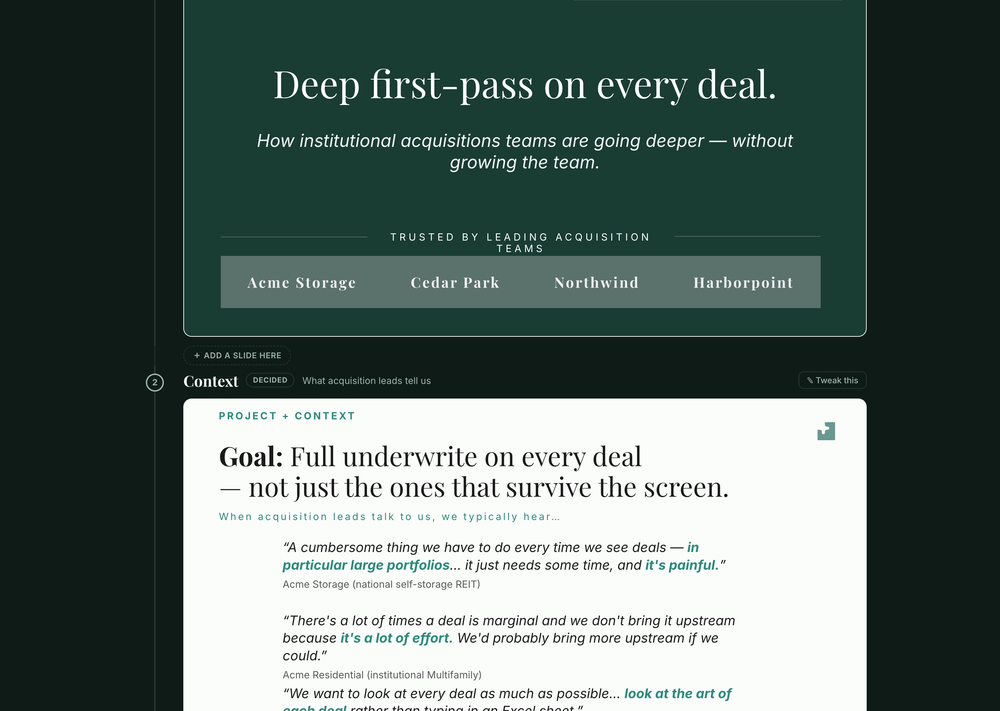
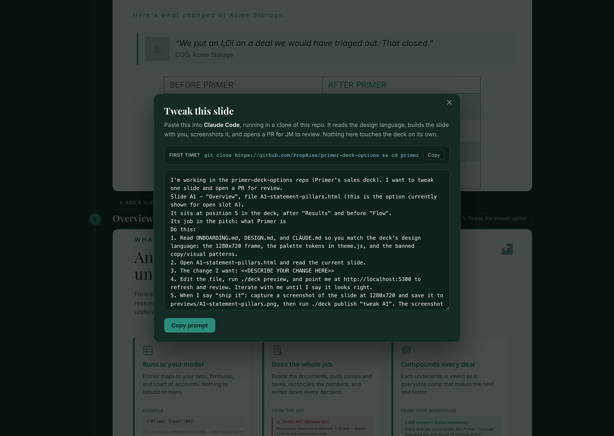

# How the "add or tweak a slide" flow works

This is the design note for the contribution flow on the gallery. It explains
what a teammate experiences, the one constraint that shapes the whole thing, and
why it's built the way it is.

## The goal

A teammate opens the gallery link, sees the deck, and decides one slide should
change — a tweak to an existing slide, or a brand-new slide between two others.
A few minutes later there's a pull request waiting for JM, with a screenshot of
the new slide in it. The teammate never had to learn git, JSON, or the design
system. They described what they wanted in plain English and their own Claude
Code did the rest.

## The one constraint that shapes everything

The gallery is a **static page on GitHub Pages.** It can copy text to the
clipboard and open links. It **cannot** run an AI, clone the repo, build a
slide, preview a build, or open a PR. So every "the AI does X" step has to
happen somewhere that can actually run an AI: the teammate's own Claude Code,
in a clone of this repo on their machine.

That rules out "click a button and watch the browser build the slide." The page
can't do it, and even if it could, we wouldn't want an unreviewed slide writing
itself into the deck. The page's real job is to hand off a great prompt to the
place where the work can happen.

## Approach A — the Prompt Launchpad

Two affordances on the gallery, each producing a tailored, ready-to-paste prompt:

- **✎ Tweak this** — on every slide. Generates a prompt to change *that exact
  slide*: its file, the role it plays, and the slides on either side of it.
- **＋ Add a slide here** — in the gap between any two slides (and at the top and
  bottom). Generates a prompt to *insert a new slide there*: both neighbours, and
  how to wire it into the running order.

Tweak and add-between are different jobs, so they get different prompts. A tweak
points at one existing file and asks for a change. An add names a gap, both
neighbours, and explains the `deck[]` + `context/` structure so the new slide
lands in the right spot.

## What it looks like

The buttons live right on the spine. **✎ Tweak this** sits on every slide's row;
**＋ Add a slide here** appears in the gap between two slides when you hover it:

Clicking either one opens a panel with a ready-to-paste prompt and a one-line
clone command for first timers. The prompt is already filled in with the slide,
where it sits, and its neighbours — you only describe the change:

Each prompt carries everything the contributor's Claude Code needs:

1. **Which file**, and where it sits in the deck (position + neighbours).
2. **The design contract** — read `ONBOARDING.md`, `DESIGN.md`, `CLAUDE.md` so the
   slide matches: the 1280×720 frame, the palette tokens, the banned patterns.
3. **The local loop** — edit, `./deck preview`, look at `http://localhost:5300`,
   refine together until it's right.
4. **The finish** — on "ship it": screenshot the slide to `previews/`, then
   `./deck publish "…"`, which opens a PR with the screenshot embedded. **Do not
   merge.**

## The screenshot in the PR

A reviewer should be able to see the new slide without checking out the branch.
So the flow always produces an image:

- `./deck shot <slide.html>` renders a slide headlessly at 1280×720 into
  `previews/`.
- `./deck publish` runs that for any changed slide, commits the PNG to the branch,
  and embeds it in the PR body (via the branch's raw URL).
- If headless Chrome isn't installed, the prompt still tells Claude Code to
  screenshot the slide and save it to `previews/` with its own tools, so the
  image lands either way.

## No auto-merge — the human is the gate

"Accept" in this flow means **open a PR**, never **merge**. That's deliberate.
The gallery is also a vote: people pick the best option for each open slide, and
JM merges the winner. If contributions merged themselves, that curation would
disappear and the deck would drift. So the contributor's job ends at a clean PR
with a screenshot; JM reviews and merges.

## End to end

1. Teammate opens the gallery link and reads the deck.
2. They hover a slide and hit **✎ Tweak this**, or **＋ Add a slide here** in a gap.
3. A panel shows the generated prompt (and the one-line clone command for first
   timers). They copy it.
4. They paste it into Claude Code running in a clone of this repo.
5. Claude Code reads the design docs, builds or edits the slide, and runs
   `./deck preview`. They watch it at `localhost:5300` and refine together.
6. When it looks right, they say "ship it." Claude Code screenshots the slide and
   runs `./deck publish`, which opens a PR with the screenshot in it.
7. JM reviews the PR and merges. The gallery updates within about 30 seconds.

## What we deliberately didn't build

- **In-browser building.** The static page can't run an AI, and we want review
  anyway.
- **Auto-merge on accept.** It would kill the vote-then-merge curation.
- **A hosted backend** to drive clones/builds/PRs. Overkill for an internal deck,
  and it would put a server between a teammate and a one-paragraph prompt.
